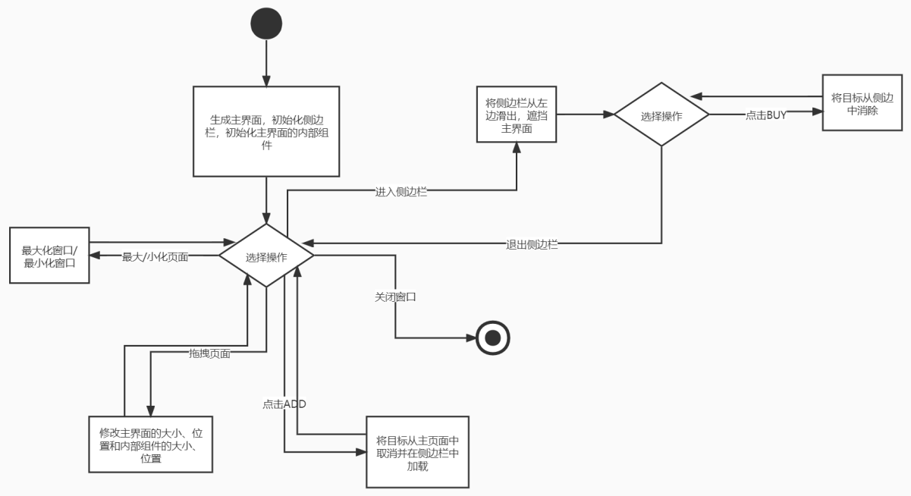
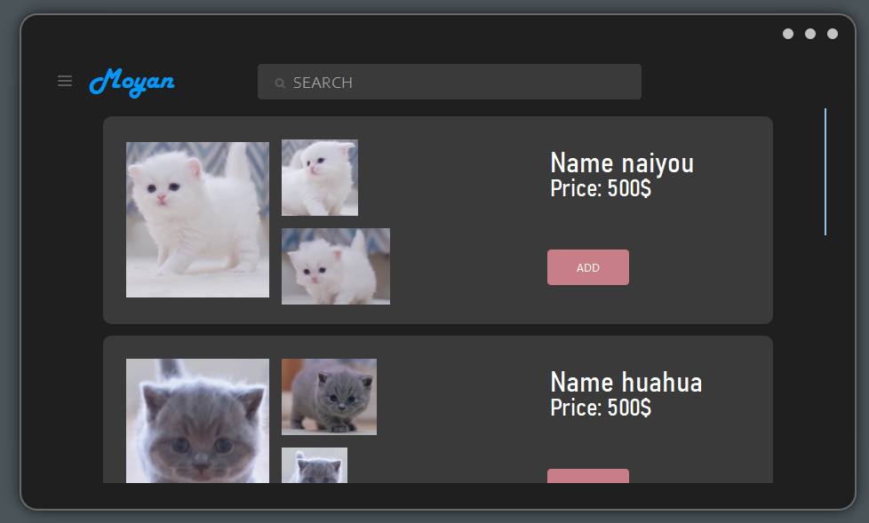
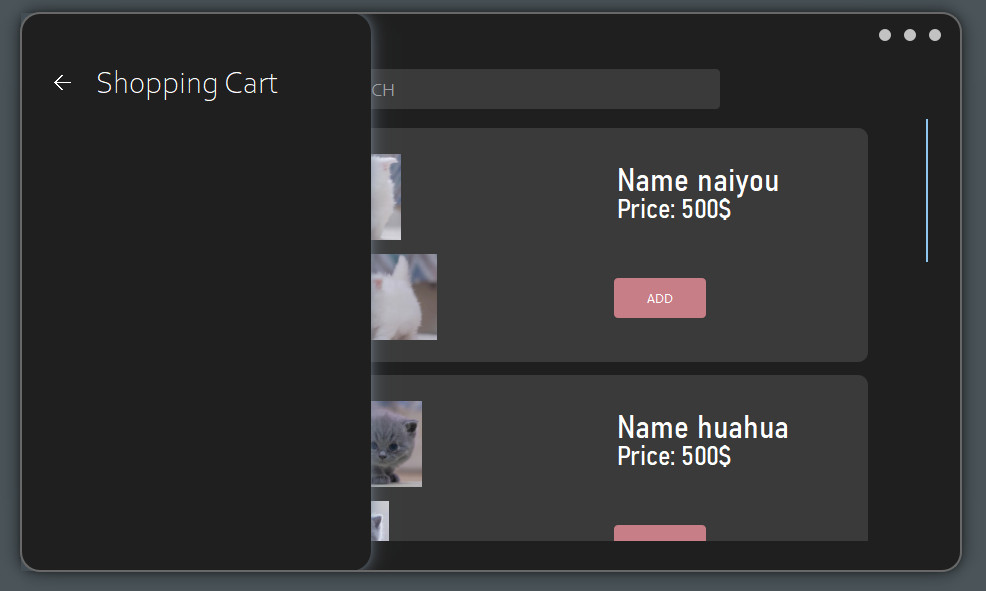
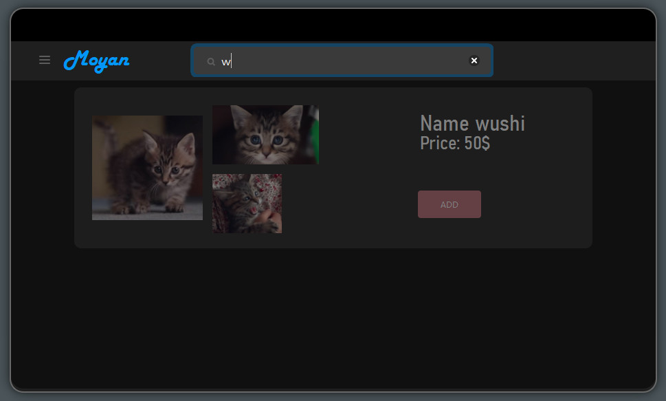

# Buy_cat_Simulator

## Introduction
这是一个用Qt6制作的购买猫猫的模拟器（有着很无聊的功能）。我写这个项目的目的是为了学习一些美化Qt界面的小技巧，所以重心没有放在完善功能上。

这个项目有一个很好看的UI，支持界面的拖拽，并且会根据拖拽的位置调整内部组件的位置，界面整体为一个圆角矩形，通过一些特殊操作去除毛刺，内部所有组件的操作都有对应的动画做平滑，使得起来不会显得生硬。

流程图：

## Demonstration

Index Page:

Slide Page:

Search bar:

Video：

<video src="演示视频.mp4" controls="controls" width="500" height="300"></video>

## Development environment

- Qt6.2.2
- Visual Studio 2022, C++11

## Technical Details

不描述具体的数学公式，有大致的实现思路描述。

1. **实现拖动边缘改变主界面的大小效果：**

给鼠标定义一个状态编码，比如当鼠标的x坐标和mainWidget的上边界差距不超过5px时将状态编码“或”上1，当鼠标的y坐标和mainWidget的左边界差距不超过5px时，将状态编码“或”上2，这时鼠标的状态编码变为3，我就可以判定现在鼠标的位置在左上角，通过“或”操作来改变鼠标状态编码的操作减少了if的次数，而且可以通过鼠标的状态编码来改变Cursor的样式。

通过一个tag来判断鼠标是否按下，当已经按下鼠标左键（但没有松开鼠标左键）时将tag设置为true，否则为false。

若tag为true，并且此时鼠标位于mainWidget边缘时，再次改变鼠标位置，mainWidget就需要改变大小，并且改变的大小要通过鼠标的位置与mainWidget的宽度或高度来进行**等比**等大或缩小mainWidget；tag为false时不会发生改变。

因为mainWidget有内部组件，所以mainWidget的最小宽高也要设置，根据内部组件的变更来进行动态调整。

2. **实现拖拽主界面来移动主界面的位置：**

类似上一个操作，设定一个tag来判断鼠标状态，并且记录鼠标的相对位置和mainWidget宽高的**比例**，每次移动鼠标就执行一次update()来更改mainWidget的绝对位置。

有一个细节，当主界面移动到距离屏幕上边界不超过5px时，就将主界面最大化（很多其他应用都有类似的功能）

3. **主界面最大化的细节处理：**

将mainWidget的(x,y)设置为(0,0)通过将宽度和高度放大到和屏幕相同，在最大化之前需要记录没最大化时的位置和宽高信息，当再次按下最大化时，需要还原到上次的位置。

最大化后要将mainWidget的外阴影和border去掉，并且从圆角矩形变为矩形（只有圆角矩形会出现毛刺，矩形不会，可以将border去掉）。

注意，最大化后mainWidget的内部组件都需要做出相应的修改。

主界面退出最大化后要做上面操作的逆操作，还原到上次记录的位置。

4. **主界面最大化的细节处理：**

记录当前鼠标相对坐标和mainWidget的宽高**比例k**，将mainWidget的宽高还原到上次的位置（相当于执行缩小操作），通过根据**K**值来调整此时mainWidget应该在的位置。

5. **主界面大小被拖动后如何调整各组件：**

调整所有侧边栏的宽度，定义为主界面的0.3但不小于某一个固定值。调整border的大小。

6. **当准备向搜索框中输入东西时会出现一个类似“专注”的状态，遮挡其他信息**

设置两个QWidget来遮挡上半部分和下半部分（颜色为全黑并设置为半透明），

7. **毛刺的处理：**

因为Qt底层渲染的原因，即使增加了去除锯齿的选项，依旧会有很严重的毛刺。

在原本的QWidget中创建了一个QWidget border，让border的颜色变为透明，同时给border创建一个边框，假设边框的宽度为x，border的宽度和高度都会增加2x，通过将border向左上移动，使得border能够覆盖住主界面的边缘，从而达到减少毛刺的效果。

8. **当鼠标移向搜索框时，搜索框会出现颜色渐变：**

首先通过QPropertyAnimation得到Color1到Color2的渐变动画，但是QWidget是没有Color属性的，无法直接将动画绑定到QWidget上面。但是QWidget可以通过修改qss做到更改QWidget的背景颜色，因此就可以动态修改QWidget的qss，通过Q_PROPERTY(QColor color READ color WRITE setColor)和setColor函数，实现动态修改qss。

9. **搜索文本框的“x”：**

当文本框中出现文字时，可以通过点击“x”将文本框中的文字清除掉；当没有文字时，“x”处于hide状态。

“x”是在一个border-radius为50%的QWidget上增加了一个svg图片。

10. **搜索框提示词颜色的修改：**

Qt时没有自带的方法可以修改这个属性的。

调整搜索框的调色板，使得组件只能使用这个颜色。

11. **Logo和搜索框的定位：**

搜索框要居中，那么搜索框左上角的x坐标应该为(当前主窗口的宽度-搜索框的宽度)/2，又因为在搜索框左边有Logo和一个按钮，所以可以通过加宽Logo的宽度，来使得搜索框向右移动，因为Logo是继承了QLabel类，增加宽度不会使得原本的字体发生改变。

12. **通过滑块的位置来调整主界面组件的位置：**

用组件的高度除以主界面的当前高度，得到一个比例，在通过主界面的当前高度得到滑块应该有的大小，再记录滑块的y轴坐标，和主界面的当前高度得到一个比例，从而调整组件的y轴位置。

13. **如何将“猫猫”图片适应组件的大小并且不产生拉伸：**

计算图片的长宽比x，和组件的高宽比y，如果x大于y就调整图片宽度，否则调整图片高度，进行等比缩小。

14. **and more..., I do not remember...**

## 吐槽

本来以为挺简单的但是实际太难写了，不要用Qt开发UI！性价比很低，同样的操作在CSS中主需要一条语句，Qt还要考虑如何通过重写事件来实现功能，即使是GUI也不如用Electron。

赶了两周，通宵一天，终于写完了，有些实现策略还是在开源项目中学到的。

参考：[GraphBuilder](https://github.com/Linloir/GraphBuilder)